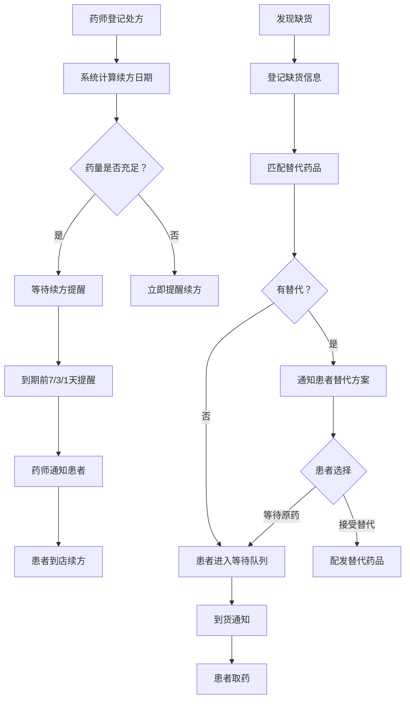

## 1. 产品概述

社区药房慢病配药台是一套面向社区药房窗口药师的数字化管理系统，解决高血压、糖尿病等慢病患者处方登记、续方提醒、缺货替代与到货通知等核心场景，彻底告别纸条记录的低效模式。

- 目标用户：社区药房窗口药师、药房管理人员
- 核心价值：零纸条化运营，降低漏配率，提升慢病患者服务体验

## 2. 核心功能

### 2.1 用户角色

| 角色 | 说明 | 核心权限 |
|------|------|----------|
| 药师 | 日常窗口操作人员 | 处方登记、续方提醒确认、缺货登记、到货通知 |
| 管理员 | 药房负责人 | 全部药师权限 + 缺货审核、替代药品维护、数据统计 |

### 2.2 功能模块

1. **工作台首页**：待办统计卡片、续方提醒队列、缺货预警列表、今日取药日历
2. **处方登记**：新增处方表单（患者信息、药品、医保类型、剩余药量、取药日期）、处方列表查询
3. **续方提醒**：自动计算续方日期、提醒列表、一键通知、提醒状态追踪
4. **缺货管理**：缺货登记、替代药品推荐与登记、到货通知自动推送

### 2.3 页面详情

| 页面名称 | 模块名称 | 功能说明 |
|----------|----------|----------|
| 工作台首页 | 待办统计卡片 | 显示待续方、缺货中、今日取药数量 |
| 工作台首页 | 续方提醒队列 | 按紧急度排列即将到期续方列表，支持一键通知 |
| 工作台首页 | 缺货预警列表 | 显示当前缺货药品及替代状态 |
| 工作台首页 | 今日取药日历 | 按时间线展示今日取药患者 |
| 处方登记页 | 新增处方表单 | 填写患者姓名、身份证号、慢病类型、药品、医保类型、剩余药量、取药日期 |
| 处方登记页 | 处方列表 | 搜索、筛选、查看处方详情，支持编辑 |
| 续方提醒页 | 提醒列表 | 按日期分组显示需续方患者，标记紧急程度 |
| 续方提醒页 | 提醒详情 | 查看患者处方历史、药品用量、一键发送通知 |
| 缺货管理页 | 缺货登记表单 | 登记缺货药品、数量、预计到货日期 |
| 缺货管理页 | 替代药品登记 | 为缺货药品指定替代药品，记录替代原因 |
| 缺货管理页 | 到货通知 | 药品到货后通知等待患者取药 |

## 3. 核心流程

**处方登记与续方提醒流程：**
药师收到患者处方 → 登记患者信息、药品、医保类型、剩余药量、取药日期 → 系统根据剩余药量自动计算预计用完日期 → 在用完前7天/3天/1天自动生成续方提醒 → 药师确认提醒并通知患者 → 患者到店续方

**缺货替代与到货通知流程：**
药师发现药品缺货 → 登记缺货信息（药品、数量、预计到货日）→ 系统自动匹配替代药品 → 药师确认替代方案并通知患者 → 患者选择替代或等待 → 到货后系统自动通知等待患者

## 4. 用户界面设计

### 4.1 设计风格

- **主色调**：沉稳的医疗蓝绿（#0D9488 teal）搭配温暖的琥珀色警示（#F59E0B amber）
- **辅助色**：浅灰底色（#F8FAFC）、深灰文字（#1E293B）、白色卡片
- **按钮风格**：圆角（rounded-lg）、柔和阴影、状态色彩明确
- **字体**：标题使用 Noto Serif SC 衬线体营造专业感，正文使用 Noto Sans SC 无衬线体保证可读性
- **布局风格**：左侧导航栏 + 右侧内容区，卡片式布局，信息密度适中
- **图标风格**：线性图标（lucide-react），统一尺寸，语义清晰
- **整体气质**：专业、温暖、高效——像一个经验丰富的老药师的工作台

### 4.2 页面设计概览

| 页面名称 | 模块名称 | UI元素 |
|----------|----------|--------|
| 工作台首页 | 待办统计卡片 | 4个彩色统计卡片，带图标和数字，hover微抬升动画 |
| 工作台首页 | 续方提醒队列 | 紧急度色带（红/黄/绿）的列表行，右侧操作按钮 |
| 工作台首页 | 缺货预警列表 | 红色标签标注缺货状态，绿色标签标注已替代 |
| 工作台首页 | 今日取药日历 | 时间线布局，圆形时间节点 + 患者信息卡 |
| 处方登记页 | 新增处方表单 | 分步表单（患者信息→药品信息→确认），浮动标签输入框 |
| 处方登记页 | 处方列表 | 搜索栏 + 表格，行展开详情，状态标签 |
| 续方提醒页 | 提醒列表 | 日期分组折叠面板，紧急度排序 |
| 缺货管理页 | 缺货登记表单 | 弹窗式表单，药品搜索下拉 |
| 缺货管理页 | 替代药品登记 | 两个药品对照卡片 + 替代原因文本框 |
| 缺货管理页 | 到货通知 | 等待队列列表，一键通知按钮 |

### 4.3 响应式设计

- 桌面优先设计，1920×1080为主视口
- 侧边栏可折叠适配平板
- 移动端切换为底部导航 + 全屏卡片
