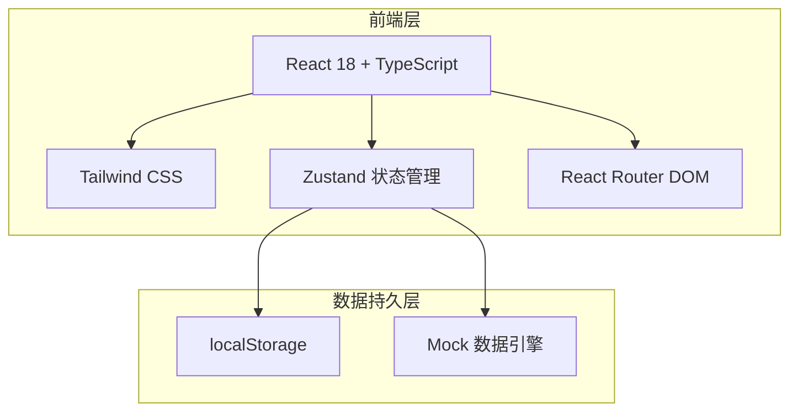
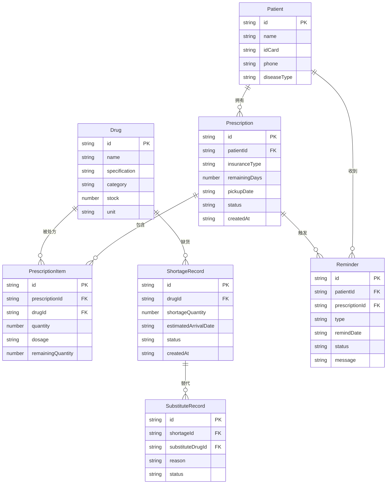

## 1. 架构设计



## 2. 技术说明

- **前端框架**：React@18 + TypeScript
- **样式方案**：Tailwind CSS@3
- **构建工具**：Vite
- **路由**：React Router DOM@6
- **状态管理**：Zustand（含 localStorage 持久化中间件）
- **图标库**：lucide-react
- **后端**：无（纯前端，使用 localStorage 持久化 + Mock 数据）
- **数据库**：无（localStorage 模拟持久化）

## 3. 路由定义

| 路由 | 用途 |
|------|------|
| `/` | 工作台首页，展示待办统计、续方提醒、缺货预警 |
| `/prescriptions` | 处方登记页，新增和查看处方列表 |
| `/prescriptions/new` | 新增处方表单页 |
| `/prescriptions/:id` | 处方详情页 |
| `/reminders` | 续方提醒页，按日期分组显示提醒列表 |
| `/shortage` | 缺货管理页，缺货登记、替代方案、到货通知 |

## 4. 数据模型

### 4.1 数据模型定义



### 4.2 数据定义

所有数据通过 Zustand store 管理，使用 `zustand/middleware` 的 `persist` 中间件自动同步到 localStorage。初始化时注入 Mock 数据（包含示例患者、药品、处方、提醒等）。

#### 核心类型定义

```typescript
type DiseaseType = 'hypertension' | 'diabetes' | 'both'
type InsuranceType = 'urban_employee' | 'urban_resident' | 'rural_coop' | 'self_pay'
type PrescriptionStatus = 'active' | 'completed' | 'expired'
type ShortageStatus = 'shortage' | 'substituted' | 'restocked'
type ReminderStatus = 'pending' | 'sent' | 'confirmed' | 'ignored'
type ReminderType = 'renewal_7d' | 'renewal_3d' | 'renewal_1d' | 'shortage_arrival' | 'substitute_notice'
```
